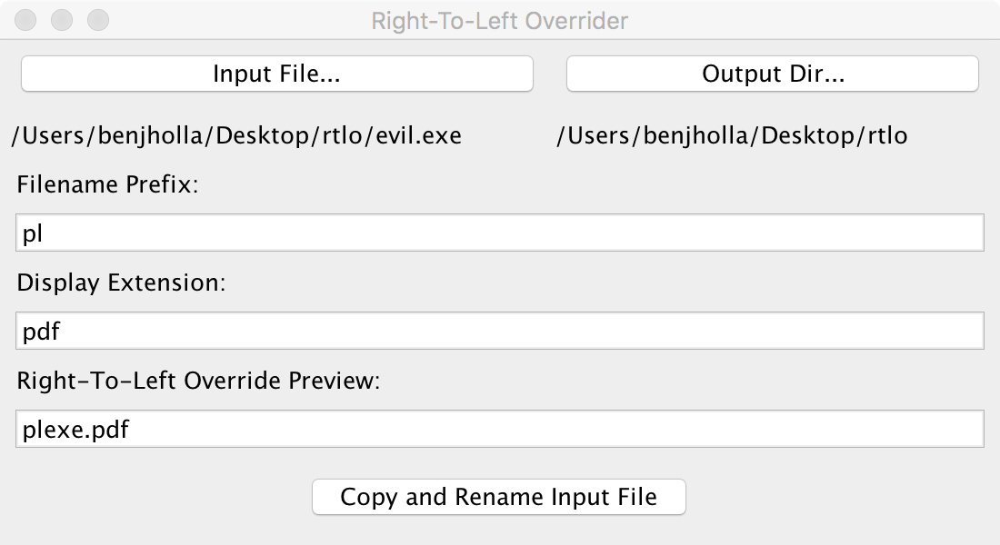

# Right-To-Left Overrider
A small utility and interface for renaming files using the Unicode Right-To-Left Override attack

## Usage
To run the Right-To-Left Overrider interface download the `rtlo.jar` and double click it or run `java -jar rtlo.jar` from the command line. You have have Java 7 or higher installed.

Select an executable input file. Some executable extensions you might consider are shown in the table below.

| **Extension** | `.bat` | `.cmd` | `.com` | `.lnk` | `.pif` | `.scr` | `.vb` | `.vbe` | `.vbs` | `.wsh` | `.jar` |
|---------------|:------:|:------:|:------:|:------:|:------:|:------:|:-----:|:------:|:------:|:------:|:------:|
| **Reversed**  | `tab.` | `dmc.` | `moc.` | `knl.` | `fip.` | `rcs.` | `bv.` | `ebv.` | `sbv.` | `hsw.` | `raj.` |

## References
- [http://www.howtogeek.com/127154/how-hackers-can-disguise-malicious-programs-with-fake-file-extensions/](http://www.howtogeek.com/127154/how-hackers-can-disguise-malicious-programs-with-fake-file-extensions/)
- [http://krebsonsecurity.com/2011/09/right-to-left-override-aids-email-attacks/](http://krebsonsecurity.com/2011/09/right-to-left-override-aids-email-attacks/)
- [https://www.youtube.com/watch?v=1J1dH49JEM8](https://www.youtube.com/watch?v=1J1dH49JEM8)
